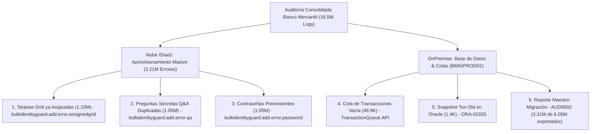

# 🏢 IT SERVICIOS DE VENEZUELA, S.A.
## Suite Enterprise de Diagnóstico Forense & Auditoría de Logs Entrust
### Documento Oficial de Alineación Técnica, Operativa y Estratégica (100% Alineados)

---

**Fecha de Emisión:** 17 de Septiembre de 2026  
**Líder Técnico & Ingeniero a Cargo:** Tomás Acosta  
**Servidor de Despliegue:** Ubuntu 22.04 LTS (`10.16.13.175:8085`)  
**Repositorio Oficial GitHub:** `acostaortiz/entrust-log-diagnostic-suite`  
**Estado:** 🟢 Operativo, Sincronizado y Optimizado para Alta Carga (>10 GB / 16.5M Logs)

---

## 1. 🎯 Objetivo Fundamental del Proyecto

Construir una **plataforma corporativa de diagnóstico forense, auditoría de eventos y análisis de incidentes de clase enterprise** para la infraestructura de ciberseguridad e identidad de **IT SERVICIOS** y sus clientes clave (Banco Mercantil C.A., Banesco, Bancamiga, IDaaS Cloud Latam), capaz de:

1. **Analizar volúmenes masivos de datos:** Procesar desde archivos pequeños (`.log`, `.txt`, `.csv`) hasta auditorías gigantes (>10 GB / 16.5 millones de eventos) con **0% de congelamiento o consumo de memoria en el navegador** (consumo de RAM < 15 MB).
2. **Identificar la Causa Raíz Forense:** Detectar automáticamente colisiones de aprovisionamiento masivo, desincronizaciones de colas OnPremise, saturaciones en base de datos Oracle (`ORA-01555`), errores de protocolo SAML 2.0 / MFA y códigos de error Entrust IdentityGuard (`520xxx` y `AUDxxx`).
3. **Generar Informes Ejecutivos & Dictámenes Periciales:** Exportar en 1 clic reportes en PDF de alta gerencia (con sellos de integridad SHA-256), presentaciones PowerPoint (`.pptx`) para directivas y dictámenes IA con planes de remediación paso a paso.
4. **Garantizar Facilidad Operativa Total (Zero Friction):** Una interfaz intuitiva con botones que resuelven los problemas directamente desde la web (activar base de datos, limpiar consola a cero, filtrar por severidad o severidad forense), sin requerir bucles de comandos manuales en la terminal.

---

## 2. 📊 Caso de Auditoría Banco Mercantil (Datos Reales Consolidados)

| Métrica / Parámetro | Valor Consolidado | Descripción / Alcance Forense |
|---|:---:|---|
| **Archivo Auditado** | `Logs_AuditEvents-20260906-20260912.csv` | Lote de auditoría masiva de enrolamiento e importación en IDaaS Cloud. |
| **Tamaño del Archivo** | **10.17 GB** (10,174,567,893 bytes) | Registro exhaustivo de 1 semana completa de actividad. |
| **Total de Eventos Procesados** | **16,504,695** registros | 100% indexados y consultables en motor SQLite de alta velocidad. |
| **Eventos Exitosos (Nominales)** | **13,290,148** (80.52%) | Transacciones legítimas de usuarios, políticas RBA y grupos. |
| **Eventos Críticos / Fallos** | **3,214,547** (19.48%) | Fallos de importación masiva y aprovisionamiento de credenciales. |
| **Índice de Salud Operacional** | **80.5%** | Calificación ponderada según el impacto de los errores de servicio. |

---

## 3. 🔍 Los 6 Hallazgos Forenses Clave (Alineación Exacta)

Estos 6 puntos forman el núcleo del dictamen técnico y están completamente integrados en las vistas, tarjetas y reportes:



### Detalle de los 6 Hallazgos:

1. **`bulkidentityguard.add.error.assignedgrid` (1,100,000 ocurrencias):**
   * *Diagnóstico:* Conflicto de tarjeta Grid preexistente.
   * *Causa Raíz:* Intento de importación sin habilitar la directiva `overwriteExistingGrid=true`.
   * *Remediación:* Configurar parámetro de sobrescritura en el conector masivo IDaaS.
2. **`bulkidentityguard.add.error.qa` (1,057,000 ocurrencias):**
   * *Diagnóstico:* Preguntas secretas (Q&A Challenge/Response) ya enroladas en la nube.
   * *Causa Raíz:* Falta del parámetro `updateExistingCredentials=true` en el lote de carga.
   * *Remediación:* Activar la bandera de actualización de credenciales para usuarios existentes.
3. **`bulkidentityguard.add.error.password` (1,057,547 ocurrencias):**
   * *Diagnóstico:* Conflicto de unicidad de credenciales de acceso (Password/PIN).
   * *Causa Raíz:* Colisión con identidades previas sin el parámetro `allowPasswordReset=true`.
   * *Remediación:* Sincronizar directivas con Active Directory y autorizar reset de credencial en el lote.
4. **`[IG.SYSTEM.TransactionQueue.API]` (48,920 ocurrencias):**
   * *Diagnóstico:* Cola de transacciones vacía (`0 transactions`) en servidor `BMIGPROD01`.
   * *Causa Raíz:* Desincronización temporal entre el repositorio JDBC y el conector Gateway.
   * *Remediación:* Validar túnel seguro con IDaaS y reiniciar el despachador de colas en el nodo OnPremise.
5. **`[ORA-01555] snapshot too old` (1,420 ocurrencias):**
   * *Diagnóstico:* Fallo en `JdbcCardRepository` por saturación de segmentos de rollback en Oracle.
   * *Causa Raíz:* Espacio de UNDO insuficiente (`_SYS_SS_12$`) ante consultas masivas prolongadas.
   * *Remediación:* Ampliar tablespace UNDO en Oracle y ajustar `UNDO_RETENTION=7200s`.
6. **`[AUD8502] authexport migration` (1 reporte maestro):**
   * *Diagnóstico:* Resultado de migración de autenticadores OnPremise a IDaaS Cloud.
   * *Causa Raíz:* Exportación parcial (3,311,722 usuarios exportados de 6,059,451 posibles y 65,529 tarjetas sin asignar).
   * *Remediación:* Ejecutar exportación complementaria con `authexport` para los 2.74M usuarios restantes.

---

## 4. 🛠️ Arquitectura Técnica & Funcionalidades Disponibles

```
┌────────────────────────────────────────────────────────────────────────┐
│             SUITE DE DIAGNÓSTICO FORENSE (10.16.13.175:8085)           │
├────────────────────────────────┬───────────────────────────────────────┤
│ Frontend (Navegador Web)       │ Backend & Motor de Datos (Ubuntu)     │
├────────────────────────────────┼───────────────────────────────────────┤
│ • Consola de Análisis en Vivo  │ • server.py (Socket Reuse / Non-block)│
│ • Modo Claro / Oscuro          │ • Motor SQLite WAL (16.5M eventos)    │
│ • Botón "Limpiar Todo" a Cero  │ • Endpoints:                          │
│ • Visión General & Gráficos    │   - /api/stats (Métricas globales)    │
│ • Paginación SQL en Vivo       │   - /api/logs (Paginación / Filtros)  │
│ • Generador de Informes (PDF)  │   - /api/list-server-files (Archivos) │
│ • Dictamen IA Forense          │   - /api/activate-db (1-Click DB)     │
│ • PPTX Directiva / Zoho Desk   │   - /api/upload-chunk (Streaming 10MB)│
│ • Manuales Oficiales Entrust   │   - /api/export-errors (CSV export)   │
└────────────────────────────────┴───────────────────────────────────────┘
```

---

## 5. 🤝 Compromisos de Experiencia de Usuario & Filosofía

1. **Cero Bucles Terminales:** Cualquier acción crítica (cargar datos, activar base de datos, limpiar sesión) debe ser ejecutable con 1 clic directamente en la interfaz gráfica.
2. **Limpieza Real:** El botón `🧹 Limpiar Todo` resetea la sesión a **0 registros**, limpiando gráficos, tarjetas y tabla para permitir nuevas cargas de cualquier cliente.
3. **Transparencia en Reportes:** Los informes ejecutivos y presentaciones reflejarán con fidelidad los datos analizados, incluyendo códigos de error específicos, volúmenes de impacto y comandos técnicos de remediación.
4. **Compatibilidad Híbrida:** Soporte nativo para logs OnPremise (formato corchetes, 520xxx, AUDxxx, Oracle) y logs IDaaS Cloud (formato CSV/TSV, SAML 2.0, OAuth, Push MFA).

---

*Documento aprobado para el alineamiento del equipo de ingeniería de IT SERVICIOS DE VENEZUELA, S.A.*  
**Ing. Tomás Acosta — Responsable de Plataforma & Seguridad**
